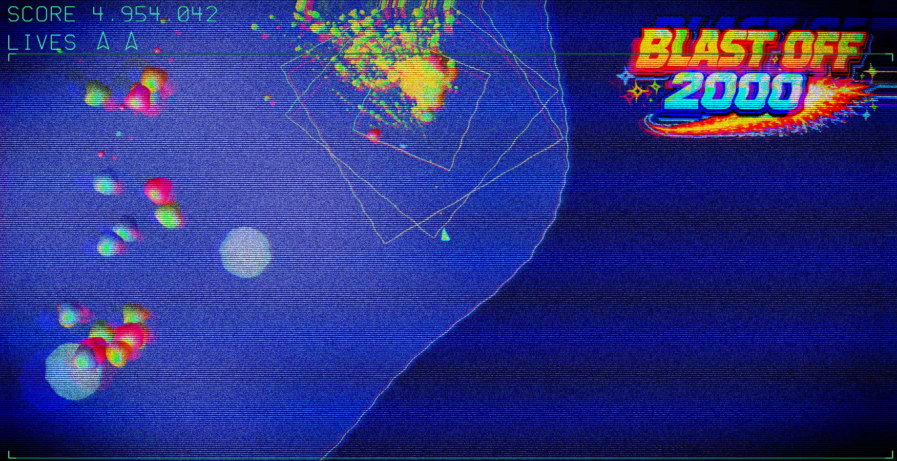

# Blast Off 2000



Simple vibe-coded arcade game with WebGL rendering, CRT/VHS post-processing, and arcade-inspired audio.

## Features
- WebGL2 renderer with ship physics, thrust, rotation, and collision against terrain, rocks, landing pads, and chasing monsters.
- Fullscreen CRT/VHS post effects: scanlines, curvature, vignette, bloom, chromatic aberration, film grain, jitter, and color bleed.
- Directional Phong-like shading on monsters; rock material shader; animated water/ripple base shader.
- Touch and keyboard controls (thrust, rotate, fire, pause, reset). Responsive layout and splash/title overlays.
- Score with easing display, monster splits, particle explosions, exhaust particles, and enemy respawns.
- Audio: randomized BGM track on first thrust, explosion/fire/pop/thrust SFX.

## Requirements

- Python 3.10+
- FastAPI
- Uvicorn

## Installation

```bash
# Create and activate virtual environment (optional but recommended)
python -m venv venv
source venv/bin/activate  # On Windows: venv\Scripts\activate

# Install dependencies
pip install -e .

# Or install directly
pip install fastapi "uvicorn[standard]"
```

## Running

```bash
uvicorn app.main:app --reload
```

Open http://127.0.0.1:8000/ in a WebGL2-compatible browser.

## Controls
- Rotate: A/D or Left/Right
- Thrust: W/Up
- Fire: Space (rapid)
- Pause: P
- Reset: R
- (Post FX always on)

## Assets & Licenses
- **Music**: All tunes generated using [Suno](https://suno.ai/)
- **Sound Effects**: All SFX generated using [ElevenLabs Sound Effects](https://elevenlabs.io/)
- **Images**: All pixel graphics generated using [OpenAI](https://openai.com/) image model
- **Code**: Vibe-coded using a mix of [OpenAI Codex](https://openai.com/codex) and [Claude Code](https://claude.ai/code)

All code and shaders are part of this project (MIT-style unless otherwise specified by repository owner).
